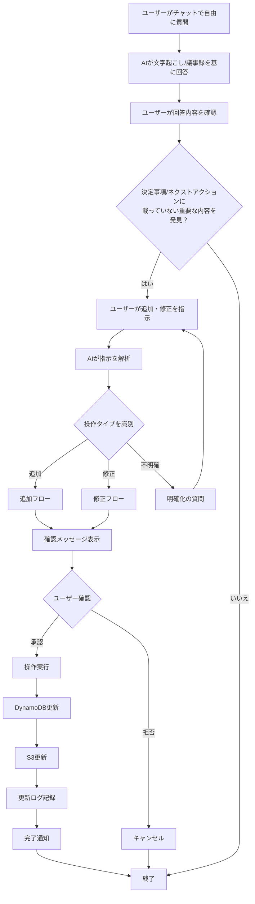
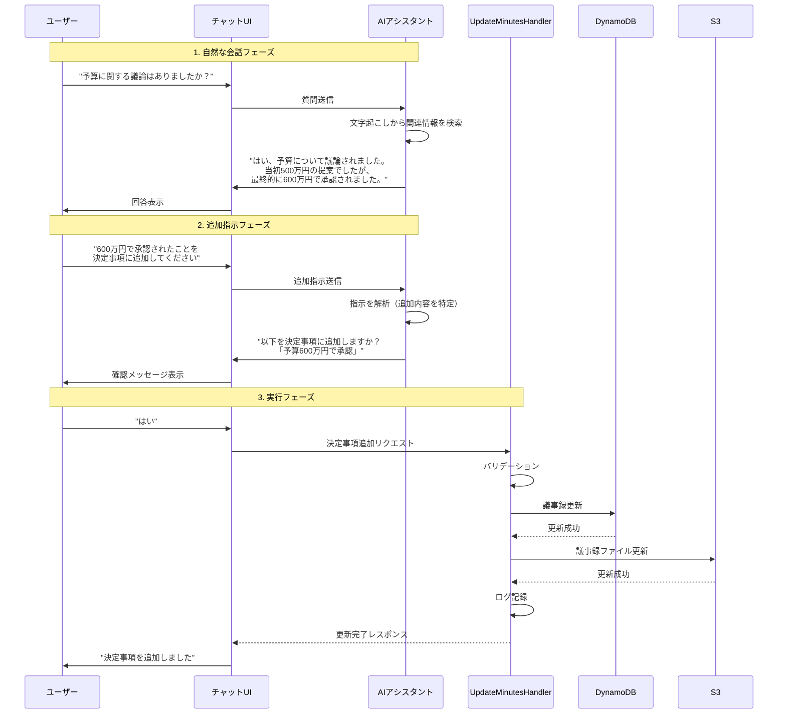
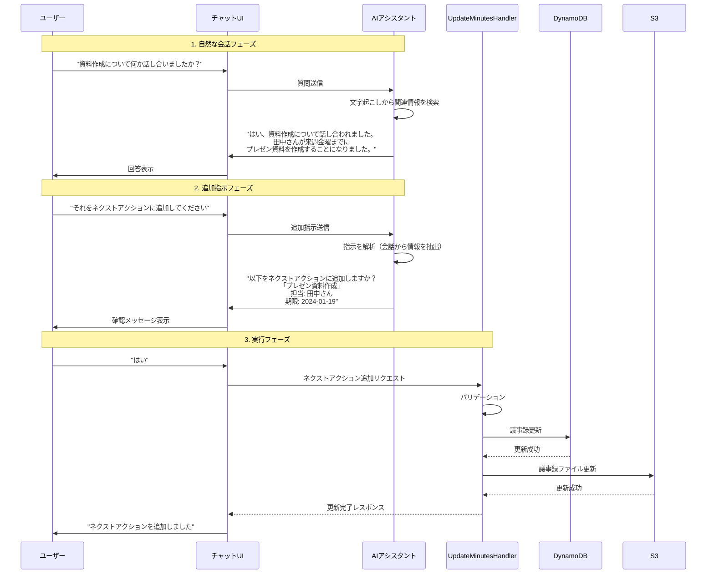
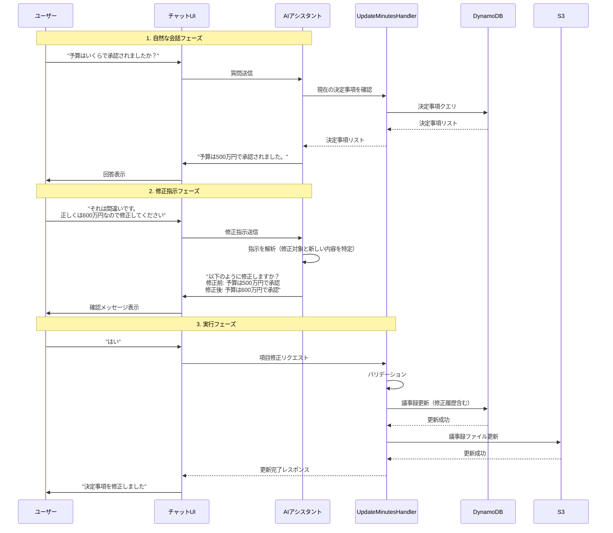
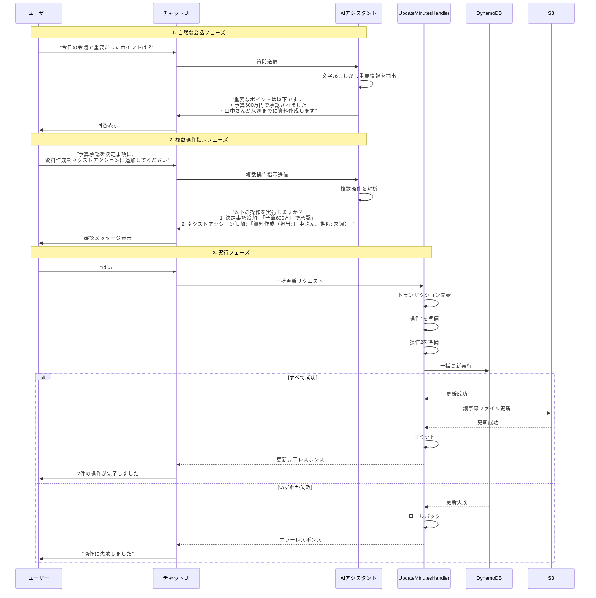
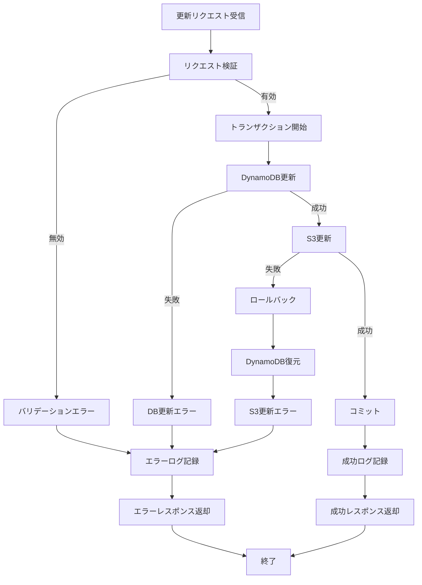
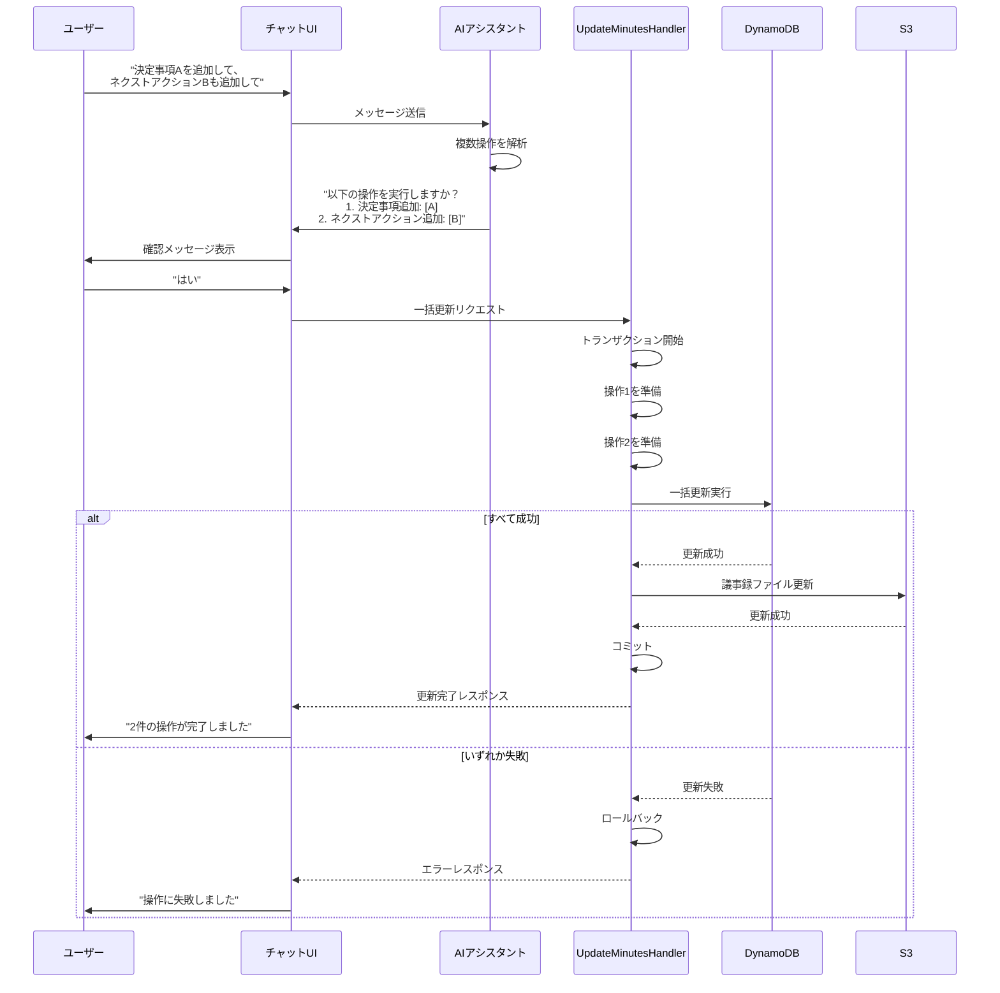

# 要件定義書

## はじめに

本機能は、AIチャット機能を通じてユーザーが議事録の決定事項やネクストアクションを追加・修正できるようにするシステムです。ユーザーはチャットで議事録の内容を質問・確認し、その結果を基に決定事項やネクストアクションを追加または修正できます。

## 利用フロー

1. ユーザーがチャットで議事録の内容について自由に質問する（例：「予算に関する議論はありましたか？」）
2. AIが文字起こしや議事録の内容を基に回答する（例：「はい、xxxとxxxについて議論されxxxとなりました」）
3. ユーザーが回答内容を確認し、決定事項やネクストアクションに載っていない重要な内容を発見する
4. ユーザーがチャットで「xxxを決定事項に追加してください」などと指示する
5. AIが内容を確認し、ユーザーの承認を得て議事録を更新する

**重要**: このフローでは、既存の決定事項やネクストアクションのリストを表示するのではなく、ユーザーの質問に対してAIが自然に回答し、その会話の中から新しい情報を抽出して議事録に反映します。

## 用語集

- **System**: 議事録作成ツール全体
- **Chat-Reflection-System**: チャットから議事録への反映システム
- **User**: 議事録作成ツールを使用するエンドユーザー
- **AI-Assistant**: チャット機能のAIアシスタント
- **Minutes**: 生成された議事録
- **Decision**: 決定事項
- **NextAction**: ネクストアクション（タスク）
- **Chat-Command**: ユーザーがチャットで発行する指示コマンド
- **Reflection-Request**: 議事録への反映リクエスト
- **DynamoDB**: 議事録データを保存するデータベース
- **S3**: 議事録ファイルを保存するストレージ

## フロー図

### 全体フロー

### 要件1: 決定事項追加フロー（自然な会話から）

### 要件2: ネクストアクション追加フロー（自然な会話から）

### 要件3: 項目修正フロー（自然な会話から）

### 要件4: 複数操作の一括実行フロー（自然な会話から）

### 要件5: エラーハンドリングフロー

### 要件9: 複数操作の一括実行フロー

## 要件

### 要件 1

**ユーザーストーリー:** ユーザーとして、チャットで確認した内容を決定事項として追加したい。そうすることで、議事録を手動で編集せずに更新できるようにする。

#### 受入基準

1. WHEN ユーザーがチャットで「これを決定事項に追加して」と指示する THEN THE System SHALL その内容を決定事項として認識する
2. WHEN ユーザーが決定事項の追加を指示する THEN THE AI-Assistant SHALL 追加する内容を確認する応答を返す
3. WHEN ユーザーが追加内容を確認する THEN THE System SHALL 決定事項を議事録に追加する
4. WHEN 決定事項が追加される THEN THE System SHALL DynamoDBとS3の両方を更新する
5. WHEN 決定事項が追加される THEN THE System SHALL 一意のIDとタイムスタンプを付与する

### 要件 2

**ユーザーストーリー:** ユーザーとして、チャットで確認した内容をネクストアクションとして追加したい。そうすることで、タスクを即座に記録できるようにする。

#### 受入基準

1. WHEN ユーザーがチャットで「これをネクストアクションに追加して」と指示する THEN THE System SHALL その内容をネクストアクションとして認識する
2. WHEN ユーザーがネクストアクションの追加を指示する THEN THE AI-Assistant SHALL 担当者や期限の情報を確認する
3. WHEN ユーザーが担当者や期限を指定する THEN THE System SHALL それらの情報を含めてネクストアクションを作成する
4. WHEN ネクストアクションが追加される THEN THE System SHALL DynamoDBとS3の両方を更新する
5. WHEN ネクストアクションが追加される THEN THE System SHALL 一意のIDとタイムスタンプを付与する

### 要件 3

**ユーザーストーリー:** ユーザーとして、既存の決定事項やネクストアクションを修正したい。そうすることで、チャットを通じて議事録を最新の状態に保てるようにする。

#### 受入基準

1. WHEN ユーザーがチャットで「決定事項を修正して」と指示する THEN THE System SHALL 修正対象を特定する
2. WHEN 修正対象が複数ある場合 THEN THE AI-Assistant SHALL どの項目を修正するか確認する
3. WHEN ユーザーが修正内容を指定する THEN THE System SHALL 該当する項目を更新する
4. WHEN 項目が修正される THEN THE System SHALL 修正履歴を記録する
5. WHEN 項目が修正される THEN THE System SHALL DynamoDBとS3の両方を更新する

### 要件 4

**ユーザーストーリー:** AIアシスタントとして、ユーザーの指示を正確に理解したい。そうすることで、誤った操作を防げるようにする。

#### 受入基準

1. WHEN ユーザーの指示が曖昧な場合 THEN THE AI-Assistant SHALL 明確化のための質問を返す
2. WHEN ユーザーが追加・修正を指示する THEN THE AI-Assistant SHALL 操作内容を要約して確認を求める
3. WHEN ユーザーが確認を承認する THEN THE System SHALL 操作を実行する
4. WHEN ユーザーが確認を拒否する THEN THE System SHALL 操作をキャンセルし、再度指示を求める
5. WHEN 操作が完了する THEN THE AI-Assistant SHALL 完了メッセージと更新内容を表示する

### 要件 5

**ユーザーストーリー:** システムとして、チャットからの議事録更新を安全に処理したい。そうすることで、データの整合性を保てるようにする。

#### 受入基準

1. WHEN 議事録更新リクエストを受信する THEN THE System SHALL リクエストの妥当性を検証する
2. WHEN 更新処理を実行する THEN THE System SHALL トランザクション的に処理する
3. WHEN DynamoDB更新が失敗する THEN THE System SHALL S3更新をロールバックする
4. WHEN 更新処理が失敗する THEN THE System SHALL エラーメッセージをユーザーに返す
5. WHEN 更新処理が成功する THEN THE System SHALL 更新ログをCloudWatch Logsに記録する

### 要件 6

**ユーザーストーリー:** ユーザーとして、チャットで追加・修正した内容を即座に確認したい。そうすることで、正しく反映されたか確認できるようにする。

#### 受入基準

1. WHEN 決定事項が追加される THEN THE System SHALL 更新された決定事項リストを返す
2. WHEN ネクストアクションが追加される THEN THE System SHALL 更新されたネクストアクションリストを返す
3. WHEN 項目が修正される THEN THE System SHALL 修正前後の内容を表示する
4. WHEN 更新が完了する THEN THE System SHALL フロントエンドに更新通知を送信する
5. WHEN フロントエンドが更新通知を受信する THEN THE System SHALL 議事録表示を自動的に更新する

### 要件 7

**ユーザーストーリー:** システムとして、チャットからの議事録更新を追跡したい。そうすることで、誰がいつ何を変更したか記録できるようにする。

#### 受入基準

1. WHEN 議事録が更新される THEN THE System SHALL ユーザーIDを記録する
2. WHEN 議事録が更新される THEN THE System SHALL 更新日時を記録する
3. WHEN 議事録が更新される THEN THE System SHALL 更新内容（追加/修正）を記録する
4. WHEN 議事録が更新される THEN THE System SHALL 更新前の値を保持する
5. WHEN 更新履歴が要求される THEN THE System SHALL 時系列で更新履歴を返す

### 要件 8

**ユーザーストーリー:** ユーザーとして、複数の操作を一度に実行したい。そうすることで、効率的に議事録を更新できるようにする。

#### 受入基準

1. WHEN ユーザーが複数の追加を指示する THEN THE System SHALL すべての項目を一括で追加する
2. WHEN ユーザーが追加と修正を同時に指示する THEN THE System SHALL 両方の操作を実行する
3. WHEN 複数の操作を実行する THEN THE System SHALL すべての操作が成功した場合のみコミットする
4. WHEN 複数の操作のいずれかが失敗する THEN THE System SHALL すべての操作をロールバックする
5. WHEN 複数の操作が完了する THEN THE System SHALL すべての変更内容を要約して表示する

### 要件 9

**ユーザーストーリー:** システムとして、チャットコマンドを柔軟に解釈したい。そうすることで、ユーザーが自然な言葉で指示できるようにする。

#### 受入基準

1. WHEN ユーザーが「追加して」「登録して」「記録して」などの表現を使う THEN THE System SHALL すべて追加操作として認識する
2. WHEN ユーザーが「修正して」「変更して」「更新して」などの表現を使う THEN THE System SHALL すべて修正操作として認識する
3. WHEN ユーザーが「決定事項」「決定」「決まったこと」などの表現を使う THEN THE System SHALL すべて決定事項として認識する
4. WHEN ユーザーが「ネクストアクション」「タスク」「TODO」「やること」などの表現を使う THEN THE System SHALL すべてネクストアクションとして認識する
5. WHEN ユーザーが会話の文脈から追加・修正内容を推測できる場合 THEN THE System SHALL 明示的な指示がなくても内容を提案する
