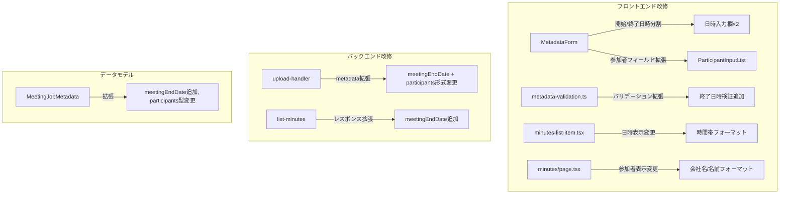
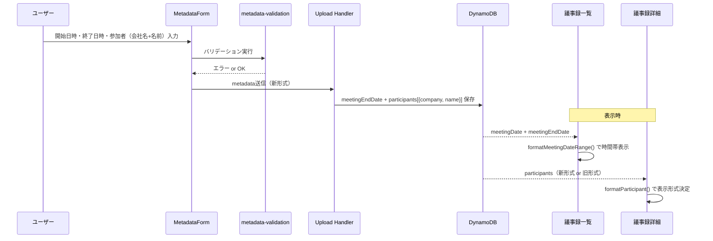

# 設計ドキュメント: 会議メタデータ入力機能の拡張

## 概要

本機能は、既存の会議メタデータ入力機能（meeting-metadata-input）を拡張し、以下の改修を行う：

1. **開催日時の分割**: 単一の「開催日時」入力欄を「開始日時」（必須）と「終了日時」（任意）の2つに分割
2. **参加者入力の拡張**: 単一テキストフィールドから「会社名」（任意）と「名前」（必須）の2フィールド構成に変更
3. **バックエンドの保存形式変更**: 参加者データを `{ company: string, name: string }` のオブジェクト配列形式で保存
4. **表示形式の改善**: 議事録詳細画面・一覧画面で時間帯表示と会社名付き参加者表示に対応
5. **後方互換性の維持**: 旧形式（文字列配列）の参加者データや終了日時なしの既存レコードを正常に表示

### 主要な設計判断

1. **既存コンポーネントの改修**: MetadataForm、DynamicInputList、metadata-validation.ts を拡張する形で実装し、新規コンポーネントの追加を最小限に抑える
2. **DynamicInputList の汎用化**: 単一フィールドと複数フィールド（会社名+名前）の両方に対応できるよう、コンポーネントを拡張する
3. **型のユニオン対応**: 参加者データを `string[] | { company: string; name: string }[]` のユニオン型で扱い、後方互換性を型レベルで保証する
4. **フォーマット関数の共通化**: 日時フォーマットと参加者表示フォーマットを共通ユーティリティ関数として実装し、一覧画面と詳細画面で再利用する

## アーキテクチャ

### コンポーネント変更概要



### データフロー



## コンポーネントとインターフェース

### 1. MetadataForm コンポーネント（改修）

開催日時を開始・終了の2フィールドに分割し、参加者入力を会社名+名前の構造に変更する。

```typescript
// frontend/components/metadata-form.tsx

// 参加者エントリの型定義
interface ParticipantEntry {
  company: string;  // 会社名（任意）
  name: string;     // 名前（必須）
}

interface MetadataFormProps {
  /** 会議名 */
  meetingName: string;
  /** 開始日時（datetime-local形式） */
  meetingStartDate: string;
  /** 終了日時（datetime-local形式、任意） */
  meetingEndDate: string;
  /** 参加者リスト */
  participants: ParticipantEntry[];
  /** 論点リスト */
  agenda: string[];
  /** 会議名変更コールバック */
  onMeetingNameChange: (value: string) => void;
  /** 開始日時変更コールバック */
  onMeetingStartDateChange: (value: string) => void;
  /** 終了日時変更コールバック */
  onMeetingEndDateChange: (value: string) => void;
  /** 参加者リスト変更コールバック */
  onParticipantsChange: (value: ParticipantEntry[]) => void;
  /** 論点リスト変更コールバック */
  onAgendaChange: (value: string[]) => void;
  /** バリデーションエラー */
  errors: MetadataFormErrors;
}
```

### 2. DynamicInputList コンポーネント（既存維持）

論点入力用として既存のDynamicInputListはそのまま維持する。参加者入力は専用のインライン実装に変更する。

### 3. 参加者入力セクション（MetadataForm内に実装）

MetadataForm内に参加者入力ロジックを直接実装する。各行は「会社名」「名前」の2フィールドで構成される。

```typescript
// 参加者入力の動的追加ロジック:
// - 名前フィールドに文字が入力されたとき、空行（name === ''）が存在しなければ新しい空行を追加
// - 空行が既に存在する場合は追加しない
// - 各行に削除ボタンを表示（行が1つのみの場合を除く）
```

### 4. バリデーション関数（改修）

```typescript
// frontend/lib/metadata-validation.ts

interface ParticipantEntry {
  company: string;
  name: string;
}

interface MetadataFormErrors {
  meetingName?: string;
  meetingDate?: string;      // 開始日時のエラー
  meetingEndDate?: string;   // 終了日時のエラー
  participants?: string;
}

/**
 * 拡張バリデーション関数
 * - meetingName: 空文字不可、最大100文字
 * - meetingStartDate: 空文字不可
 * - meetingEndDate: 入力されている場合、meetingStartDate より後であること
 * - participants: 1名以上の name が非空であること
 */
export function validateMetadataForm(
  meetingName: string,
  meetingStartDate: string,
  meetingEndDate: string,
  participants: ParticipantEntry[]
): MetadataFormErrors;

/**
 * 参加者リストから名前が空の入力行を除外する
 */
export function filterEmptyParticipants(
  participants: ParticipantEntry[]
): ParticipantEntry[];

/**
 * 日時の範囲表示をフォーマットする
 * - 開始日時と終了日時の両方がある場合: 「YYYY/MM/DD HH:MM 〜 HH:MM」
 * - 開始日時のみの場合: 「YYYY/MM/DD HH:MM」
 */
export function formatMeetingDateRange(
  startDate: string,
  endDate?: string | null
): string;

/**
 * 参加者の表示文字列を生成する
 * - 新形式（{company, name}）: 会社名がある場合「会社名 / 名前」、ない場合「名前」
 * - 旧形式（string）: そのまま表示
 */
export function formatParticipant(
  participant: string | { company: string; name: string }
): string;

/**
 * 表示用の日時を解決する（既存関数を維持）
 */
export function resolveDisplayDate(
  meetingDate: string | undefined | null,
  createdAt: string
): string;
```

### 5. バックエンド: Upload Handler（改修）

```typescript
// src/lambdas/upload-handler/index.ts

// リクエストボディの拡張
interface UploadRequest {
  fileName: string;
  fileSize: number;
  contentType: string;
  metadata?: {
    meetingTitle?: string;
    meetingDate?: string;        // 開始日時（ISO 8601形式）
    meetingEndDate?: string;     // 終了日時（ISO 8601形式、任意）
    participants?: Array<{ company: string; name: string }>;  // 新形式
    agenda?: string[];
  };
  meetingContext?: MeetingContext;
}
```

### 6. バックエンド: List Minutes（改修）

```typescript
// src/lambdas/list-minutes/index.ts

interface MinutesSummary {
  jobId: string;
  userId: string;
  meetingName: string;
  createdAt: string;
  meetingDate?: string;      // 開始日時
  meetingEndDate?: string;   // 終了日時（新規追加）
  summaryPreview: string;
  status: string;
}
```

### 7. フロントエンド型定義の拡張

```typescript
// frontend/types/index.ts

// 参加者エントリ型（新規追加）
export interface ParticipantEntry {
  company: string;
  name: string;
}

// 議事録サマリーの拡張
export interface MinutesSummary {
  jobId: string;
  userId: string;
  meetingName: string;
  createdAt: string;
  meetingDate?: string;
  meetingEndDate?: string;    // 新規追加
  summaryPreview: string;
  status: JobStatus;
}

// 議事録の拡張
export interface Minutes {
  // ... 既存フィールド
  meetingDate?: string;
  meetingEndDate?: string;                                    // 新規追加
  participants?: string[] | ParticipantEntry[];               // ユニオン型（後方互換性）
}

// メタデータフォームエラーの拡張
export interface MetadataFormErrors {
  meetingName?: string;
  meetingDate?: string;
  meetingEndDate?: string;    // 新規追加
  participants?: string;
}
```

## データモデル

### DynamoDB ジョブレコードの metadata フィールド拡張

```typescript
// src/models/meeting-job.ts

export interface MeetingJobMetadata {
  meetingTitle?: string;
  meetingDate?: string;           // 開始日時（ISO 8601形式）
  meetingEndDate?: string;        // 終了日時（ISO 8601形式、新規追加）
  participants?: string[] | Array<{ company: string; name: string }>;  // ユニオン型
  agenda?: string[];
}
```

### バリデーションルール

| フィールド | 必須 | バリデーション |
|-----------|------|--------------|
| meetingTitle | ○ | 空文字不可、最大100文字 |
| meetingDate（開始日時） | ○ | 空文字不可、datetime-local形式 |
| meetingEndDate（終了日時） | × | 入力時は開始日時より後であること |
| participants[].name | ○（1名以上） | 空文字不可、最大50文字 |
| participants[].company | × | 最大50文字 |
| agenda | × | 空の項目は除外して送信、各項目最大200文字 |

### 後方互換性マトリクス

| データ形式 | 表示画面 | 処理方法 |
|-----------|---------|---------|
| participants: string[] | 詳細画面 | 各文字列をそのまま名前として表示 |
| participants: {company, name}[] | 詳細画面 | 「会社名 / 名前」形式で表示 |
| meetingEndDate: undefined | 一覧/詳細 | 開始日時のみ表示 |
| meetingDate: undefined | 一覧 | createdAt にフォールバック |

## 正確性プロパティ

*プロパティとは、システムのすべての有効な実行において真であるべき特性や振る舞いのことです。プロパティは、人間が読める仕様と機械的に検証可能な正確性保証の橋渡しとなります。*

### Property 1: 終了日時バリデーション

*任意の*有効な開始日時と終了日時のペアに対して、バリデーション関数は終了日時が開始日時より後の場合にのみ終了日時エラーを返さず、終了日時が開始日時以前の場合にエラーメッセージを返す。

**Validates: Requirements 1.5, 1.6, 3.3**

### Property 2: バリデーション関数の包括的正確性

*任意の*フォーム入力状態（meetingName, meetingStartDate, meetingEndDate, participants）に対して、バリデーション関数は以下を満たす：meetingNameが非空かつmeetingStartDateが非空かつparticipantsに1つ以上のnameが非空のエントリが含まれかつ（meetingEndDateが空または開始日時より後）の場合にのみ空のエラーオブジェクトを返す。

**Validates: Requirements 3.1, 3.2, 3.4, 3.5, 7.4**

### Property 3: 動的参加者行の追加ロジック

*任意の*参加者リストに対して、名前フィールドへの入力後、空行（name === ''）が存在しない場合はリストの長さが1増加し、空行が既に存在する場合はリストの長さが変化しない。

**Validates: Requirements 2.6, 2.7**

### Property 4: 削除ボタン表示条件

*任意の*参加者リストの行数Nに対して、N > 1のとき各行に削除ボタンが表示され、N = 1のとき削除ボタンは表示されない。

**Validates: Requirements 2.8**

### Property 5: 参加者行の削除ロジック

*任意の*参加者リスト（長さ2以上）と任意の有効なインデックスiに対して、i番目の要素を削除した結果は元のリストからi番目の要素を除いたリストと等しく、残りの要素の相対順序は保持される。

**Validates: Requirements 2.9**

### Property 6: 参加者フィルタリング

*任意の*参加者エントリ配列に対して、フィルタリング関数の結果にはnameが空文字列またはホワイトスペースのみの要素が含まれず、かつnameが非空のすべての要素が保持される。

**Validates: Requirements 4.2**

### Property 7: 日時フォーマット関数

*任意の*有効な開始日時文字列と任意の終了日時文字列（存在する場合）に対して、フォーマット関数は以下を満たす：終了日時が存在する場合は「YYYY/MM/DD HH:MM 〜 HH:MM」形式の文字列を返し、終了日時が存在しない場合は「YYYY/MM/DD HH:MM」形式の文字列を返す。

**Validates: Requirements 5.1, 5.2, 6.1, 6.2**

### Property 8: 日時解決関数

*任意の*ジョブデータに対して、日時解決関数はmeetingDateフィールドが存在し非空の場合はmeetingDateを返し、存在しないまたは空の場合はcreatedAtを返す。

**Validates: Requirements 6.3, 7.3**

### Property 9: 参加者表示フォーマット

*任意の*参加者データに対して、フォーマット関数は以下を満たす：新形式（{company, name}）でcompanyが非空の場合は「会社名 / 名前」形式を返し、companyが空の場合は名前のみを返し、旧形式（string）の場合はその文字列をそのまま返す。

**Validates: Requirements 5.3, 5.4, 5.5, 7.2**

## エラーハンドリング

### フロントエンド

| エラー状況 | 対応 |
|-----------|------|
| 開始日時未入力でアップロード試行 | 「開始日時を入力してください」をインライン表示 |
| 終了日時が開始日時以前 | 「終了日時は開始日時より後に設定してください」をインライン表示 |
| 参加者名が1名も入力されていない | 「参加者を1名以上入力してください」をインライン表示 |
| 会議名未入力 | 「会議名を入力してください」をインライン表示（既存維持） |
| APIリクエスト失敗 | toast通知でエラーメッセージを表示。リトライ可能 |

### バックエンド

| エラー状況 | 対応 |
|-----------|------|
| metadataフィールドの形式不正 | 400 Bad Request + バリデーションエラーメッセージ |
| meetingEndDateが不正なISO形式 | 400 Bad Request + エラーメッセージ |
| DynamoDB書き込み失敗 | 500 Internal Server Error + ログ記録 |
| 旧形式participantsの読み取り | 文字列配列として正常処理（グレースフルデグレード） |

### 後方互換性のエラーハンドリング

- `participants` が `string[]` 形式の既存レコード → 表示時に各文字列をそのまま名前として扱う
- `meetingEndDate` が存在しない既存レコード → 開始日時のみの表示形式を使用
- `meetingDate` が存在しない既存レコード → `createdAt` にフォールバック（既存動作維持）

## テスト戦略

### プロパティベーステスト

プロパティベーステストライブラリとして **fast-check** を使用する。

**設定:**
- 各プロパティテストは最低100回のイテレーションを実行
- 各テストにはデザインドキュメントのプロパティ番号をタグとして付与
- タグ形式: `Feature: meeting-metadata-enhancement, Property {number}: {property_text}`

**対象プロパティ:**
1. 終了日時バリデーション（Property 1）
2. バリデーション関数の包括的正確性（Property 2）
3. 動的参加者行の追加ロジック（Property 3）
4. 削除ボタン表示条件（Property 4）
5. 参加者行の削除ロジック（Property 5）
6. 参加者フィルタリング（Property 6）
7. 日時フォーマット関数（Property 7）
8. 日時解決関数（Property 8）
9. 参加者表示フォーマット（Property 9）

### ユニットテスト

**フロントエンド:**
- MetadataFormコンポーネントのレンダリングテスト（開始/終了日時の2フィールド表示確認）
- 参加者入力の2フィールド（会社名+名前）表示確認
- バリデーションエラーメッセージの表示テスト
- 議事録一覧の時間帯表示テスト
- 議事録詳細画面の参加者表示テスト（新形式・旧形式）

**バックエンド:**
- Upload Handlerのmetadata保存テスト（meetingEndDate、新形式participants）
- List Minutesのレスポンス形式テスト（meetingEndDate含む）
- 後方互換性テスト（旧形式データの読み取り）

### 統合テスト

- アップロード→DynamoDB保存→議事録一覧表示の一連のフロー
- 旧形式データと新形式データの混在表示
- 終了日時あり/なしの両パターンでの表示確認

### E2Eテスト

- ファイル選択→メタデータ入力（開始/終了日時、会社名+名前）→アップロード→議事録表示の全フロー
- 終了日時バリデーションエラーの確認
- 参加者の動的追加・削除操作
- 後方互換性（旧データの表示確認）
