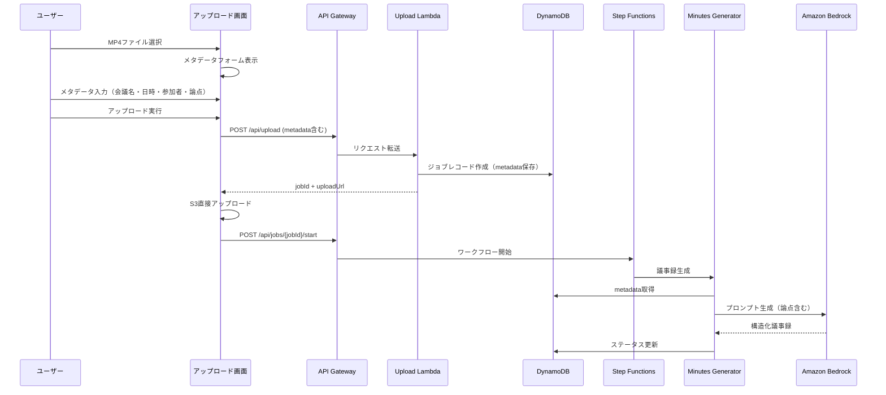
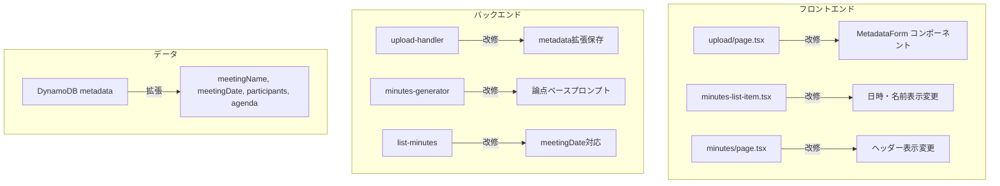

# 設計ドキュメント: 会議メタデータ入力機能

## 概要

本機能は、既存のファイルアップロード画面を改修し、会議メタデータ（会議名・開催日時・参加者・論点）の入力フォームを追加する。入力されたメタデータはバックエンドに保存され、議事録生成時のAIプロンプトに活用される。また、議事録一覧画面と議事録詳細画面の表示を改善し、入力されたメタデータを反映する。

### 主要な設計判断

1. **既存のmeetingContext/metadataフィールドの拡張**: 新規テーブルを作成せず、既存のDynamoDBジョブレコードの`metadata`フィールドを拡張して会議メタデータを保存する
2. **後方互換性の維持**: 過去に生成された議事録（メタデータなし）は従来通りの表示を維持する
3. **フロントエンド中心の変更**: バックエンドのAPI構造は変更せず、既存のmetadataフィールドに新しいフィールドを追加する形で対応する
4. **論点の二重活用**: 入力された論点はAIプロンプトの構造化指示として使用し、未入力時はAIが自動抽出する

## アーキテクチャ

### システム構成図



### コンポーネント変更概要



## コンポーネントとインターフェース

### 1. フロントエンド: MetadataForm コンポーネント（新規）

アップロード画面内に配置する会議メタデータ入力フォームコンポーネント。

```typescript
// frontend/components/metadata-form.tsx

interface MetadataFormProps {
  // フォーム値
  meetingName: string;
  meetingDate: string;
  participants: string[];
  agenda: string[];
  // コールバック
  onMeetingNameChange: (value: string) => void;
  onMeetingDateChange: (value: string) => void;
  onParticipantsChange: (value: string[]) => void;
  onAgendaChange: (value: string[]) => void;
  // バリデーション
  errors: MetadataFormErrors;
}

interface MetadataFormErrors {
  meetingName?: string;
  meetingDate?: string;
  participants?: string;
}
```

### 2. フロントエンド: DynamicInputList コンポーネント（新規）

参加者・論点の動的入力欄を管理する汎用コンポーネント。

```typescript
// frontend/components/dynamic-input-list.tsx

interface DynamicInputListProps {
  // 入力値の配列
  values: string[];
  // コールバック
  onChange: (values: string[]) => void;
  // 表示設定
  placeholder: string;
  label: string;
  required?: boolean;
}
```

**動的追加ロジック:**
- 入力欄に文字が入力されたとき、空の入力欄が存在しなければ新しい空の入力欄を追加
- 空の入力欄が既に存在する場合は追加しない
- 各入力欄に削除ボタンを表示（入力欄が1つのみの場合を除く）

### 3. フロントエンド: アップロード画面の改修

```typescript
// frontend/app/upload/page.tsx の状態追加

// 既存のmeetingContext関連のstateを置き換え
const [meetingName, setMeetingName] = useState('');
const [meetingDate, setMeetingDate] = useState('');
const [participants, setParticipants] = useState<string[]>(['']);
const [agenda, setAgenda] = useState<string[]>(['']);
const [formErrors, setFormErrors] = useState<MetadataFormErrors>({});
```

### 4. バックエンド: Upload Handler の改修

既存の`metadata`フィールドに`agenda`を追加。

```typescript
// リクエストボディの拡張
interface UploadRequest {
  fileName: string;
  fileSize: number;
  contentType: string;
  metadata?: {
    meetingTitle?: string;   // 会議名
    meetingDate?: string;    // 開催日時（ISO 8601形式）
    participants?: string[]; // 参加者リスト
    agenda?: string[];       // 論点リスト（新規追加）
  };
  meetingContext?: MeetingContext; // 既存（後方互換性維持）
}
```

### 5. バックエンド: Minutes Generator の改修

論点が入力されている場合、AIプロンプトに論点を明示的に含める。

```typescript
// 議事録生成時のプロンプト構築ロジック
// metadata.agenda が存在する場合:
//   → 入力された論点をベースに議事録を構造化するよう指示
// metadata.agenda が存在しない場合:
//   → AIが文字起こしから論点を自動抽出するよう指示（現行動作）
// どちらの場合も同じ出力フォーマット（論点→内容→結論→ネクストアクション）
```

### 6. バックエンド: List Minutes の改修

議事録一覧のレスポンスに`meetingDate`を追加し、表示名を`metadata.meetingTitle`から取得。

```typescript
// レスポンスの変更
interface MinutesSummary {
  jobId: string;
  userId: string;
  meetingName: string;      // metadata.meetingTitle || videoFileName
  createdAt: string;
  meetingDate?: string;     // metadata.meetingDate（新規追加）
  summaryPreview: string;
  status: string;
}
```

### 7. フロントエンド: 議事録一覧の表示改修

```typescript
// minutes-list-item.tsx の変更
// 日時表示: meetingDate が存在すれば meetingDate を表示、なければ createdAt をフォールバック
// 会議名表示: meetingName フィールドをそのまま使用（バックエンドで解決済み）
```

### 8. フロントエンド: 議事録詳細画面のヘッダー改修

```typescript
// jobs/[jobId]/minutes/page.tsx の変更
// ページタイトル: minutes.meetingTitle を使用（存在する場合）
// タイトル下: 開催日時と参加者をシンプルに表示
// ラベルなし: 「会議メタデータヘッダー」等のラベルは表示しない
// フォールバック: メタデータがない場合は従来通りの表示
```

## データモデル

### DynamoDB ジョブレコードの metadata フィールド拡張

```typescript
// src/models/meeting-job.ts の変更

export interface MeetingJobMetadata {
  meetingTitle?: string;     // 会議名（既存）
  meetingDate?: string;      // 開催日時 ISO 8601形式（既存だが必須化）
  participants?: string[];   // 参加者リスト（既存）
  agenda?: string[];         // 論点リスト（新規追加）
}
```

### フロントエンド型定義の拡張

```typescript
// frontend/types/index.ts の変更

export interface MinutesSummary {
  jobId: string;
  userId: string;
  meetingName: string;
  createdAt: string;
  meetingDate?: string;      // 新規追加: 会議開催日時
  summaryPreview: string;
  status: JobStatus;
}

export interface Job {
  // ... 既存フィールド
  metadata?: {
    meetingTitle?: string;
    meetingDate?: string;
    participants?: string[];
    agenda?: string[];       // 新規追加
  };
}

export interface Minutes {
  // ... 既存フィールド
  meetingTitle?: string;     // 既存
  meetingDate?: string;      // 新規追加: 会議開催日時
  participants?: string[];   // 新規追加: 参加者リスト
}
```

### バリデーションルール

| フィールド | 必須 | バリデーション |
|-----------|------|--------------|
| meetingTitle | ○ | 空文字不可、最大100文字 |
| meetingDate | ○ | ISO 8601形式の日時文字列 |
| participants | ○ | 1名以上、各名前は空文字不可、最大50文字 |
| agenda | × | 空の項目は除外して送信、各項目最大200文字 |

## 正確性プロパティ

*プロパティとは、システムのすべての有効な実行において真であるべき特性や振る舞いのことです。プロパティは、人間が読める仕様と機械的に検証可能な正確性保証の橋渡しとなります。*

### Property 1: 動的入力欄の追加

*任意の*文字列配列（DynamicInputListの値）と任意の非空文字列入力に対して、空の入力欄が存在しない状態で入力が行われた場合、入力欄の数は正確に1つ増加する。

**Validates: Requirements 2.2, 3.2**

### Property 2: 空の入力欄が存在する場合の追加抑制

*任意の*文字列配列（少なくとも1つの空文字列を含む）に対して、別の入力欄に文字を入力しても、配列の長さは変化しない。

**Validates: Requirements 2.3, 3.3**

### Property 3: 削除ボタンの表示条件

*任意の*入力欄数N（N >= 1）に対して、N > 1のとき各入力欄に削除ボタンが表示され、N = 1のとき削除ボタンは表示されない。

**Validates: Requirements 2.4, 3.4**

### Property 4: 入力欄の削除

*任意の*文字列配列（長さ2以上）と任意の有効なインデックスiに対して、i番目の要素を削除した結果は、元の配列からi番目の要素を除いた配列と等しく、残りの要素の相対順序は保持される。

**Validates: Requirements 2.5, 3.5**

### Property 5: メタデータバリデーション

*任意の*フォーム入力状態に対して、バリデーション関数は以下を満たす：meetingNameが非空かつmeetingDateが有効な日時文字列かつparticipantsに1つ以上の非空文字列が含まれる場合にのみtrueを返し、それ以外の場合はfalseを返す。

**Validates: Requirements 4.4, 4.5**

### Property 6: 空要素のフィルタリング

*任意の*文字列配列に対して、送信前フィルタリング処理の結果には空文字列およびホワイトスペースのみの文字列が含まれず、かつ非空要素はすべて保持される。

**Validates: Requirements 5.2, 5.3**

### Property 7: 論点ベースのプロンプト生成

*任意の*非空の論点リストに対して、生成されるAIプロンプト文字列にはすべての論点が含まれる。

**Validates: Requirements 6.1**

### Property 8: 出力フォーマットの一貫性

*任意の*論点リスト（空リストを含む）に対して、生成されるAIプロンプトは同一のJSON出力形式（agendaItems構造：issue, discussion, conclusion, nextIssues, nextActions）を要求する。

**Validates: Requirements 6.3**

### Property 9: 議事録一覧の日時表示解決

*任意の*ジョブデータに対して、日時表示解決関数は以下を満たす：meetingDateフィールドが存在する場合はmeetingDateを返し、存在しない場合はcreatedAtを返す。

**Validates: Requirements 7.3, 7.4**

## エラーハンドリング

### フロントエンド

| エラー状況 | 対応 |
|-----------|------|
| 必須項目未入力でアップロード試行 | フォーム上にインラインエラーメッセージを表示。アップロードボタンを無効化 |
| 参加者名が最大文字数超過 | 入力時にリアルタイムでエラー表示 |
| 論点が最大文字数超過 | 入力時にリアルタイムでエラー表示 |
| APIリクエスト失敗 | toast通知でエラーメッセージを表示。リトライ可能 |
| 日時入力が不正な形式 | datetime-local入力を使用し、ブラウザネイティブのバリデーションを活用 |

### バックエンド

| エラー状況 | 対応 |
|-----------|------|
| metadataフィールドの形式不正 | 400 Bad Request + バリデーションエラーメッセージ |
| DynamoDB書き込み失敗 | 500 Internal Server Error + ログ記録 |
| 議事録生成時のmetadata取得失敗 | metadataなしとして処理を継続（グレースフルデグレード） |
| 論点が極端に多い場合（プロンプトサイズ超過） | 最初の20件に制限してプロンプトに含める |

### 後方互換性

- metadataフィールドが存在しない既存レコードは、従来通りの動作を維持
- フロントエンドは`meetingDate`が`undefined`の場合に`createdAt`にフォールバック
- 議事録詳細画面は`meetingTitle`が`undefined`の場合に`videoFileName`にフォールバック
- `participants`が`undefined`の場合、参加者表示セクションを非表示

## テスト戦略

### プロパティベーステスト

プロパティベーステストライブラリとして **fast-check** を使用する。

**設定:**
- 各プロパティテストは最低100回のイテレーションを実行
- 各テストにはデザインドキュメントのプロパティ番号をタグとして付与
- タグ形式: `Feature: meeting-metadata-input, Property {number}: {property_text}`

**対象プロパティ:**
1. DynamicInputListの動的追加ロジック（Property 1, 2）
2. 削除ボタン表示条件（Property 3）
3. 入力欄削除ロジック（Property 4）
4. バリデーション関数（Property 5）
5. 空要素フィルタリング（Property 6）
6. プロンプト生成ロジック（Property 7, 8）
7. 日時表示解決ロジック（Property 9）

### ユニットテスト

**フロントエンド:**
- MetadataFormコンポーネントのレンダリングテスト（要件1の受入条件）
- バリデーションエラーメッセージの表示テスト（要件4.1〜4.3）
- 議事録一覧の表示名フォールバックテスト（要件7.1, 7.2）
- 議事録詳細画面のヘッダー表示テスト（要件8.1〜8.4）

**バックエンド:**
- Upload Handlerのmetadata保存テスト
- Minutes Generatorのプロンプト構築テスト（論点あり/なし）
- List Minutesのレスポンス形式テスト

### 統合テスト

- アップロード→DynamoDB保存→議事録生成の一連のフロー
- メタデータ付きジョブの一覧取得
- 後方互換性（メタデータなしの既存ジョブの表示）

### E2Eテスト

- ファイル選択→メタデータ入力→アップロード→議事録表示の全フロー
- バリデーションエラー表示の確認
- 動的入力欄の追加・削除操作

