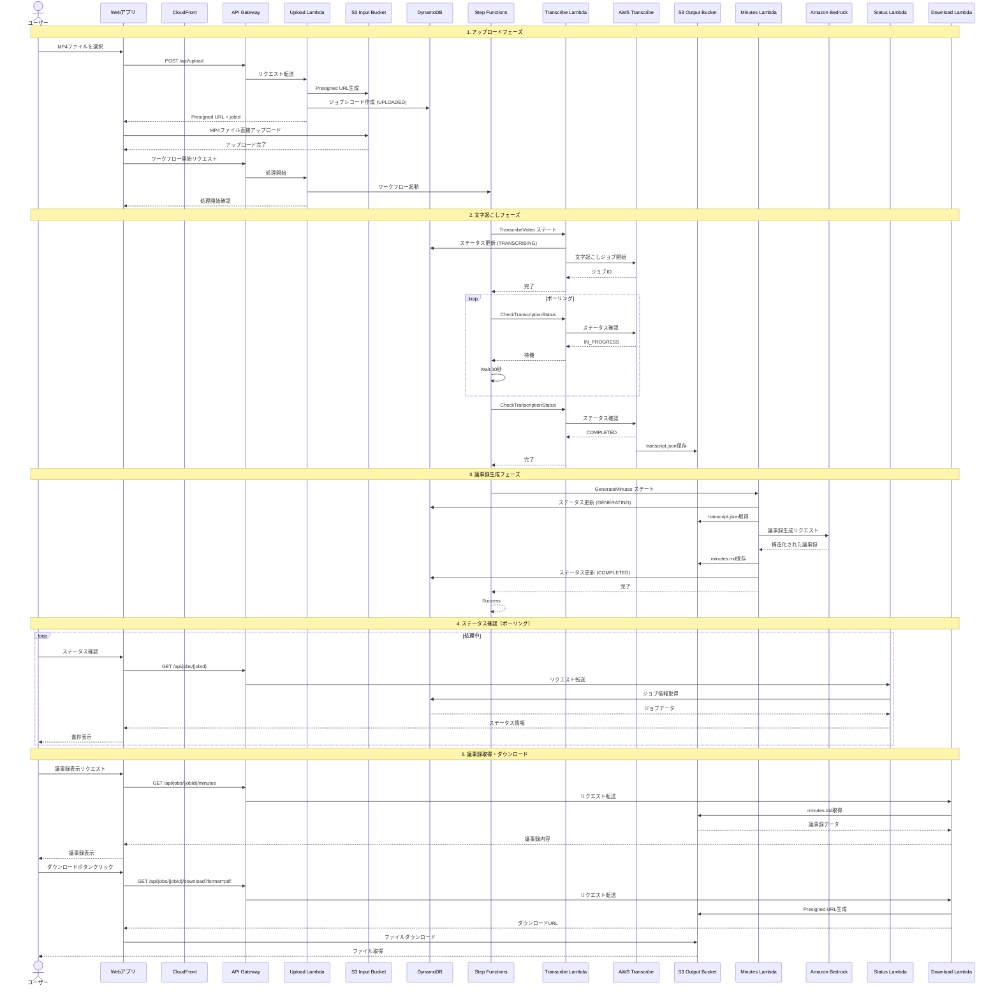
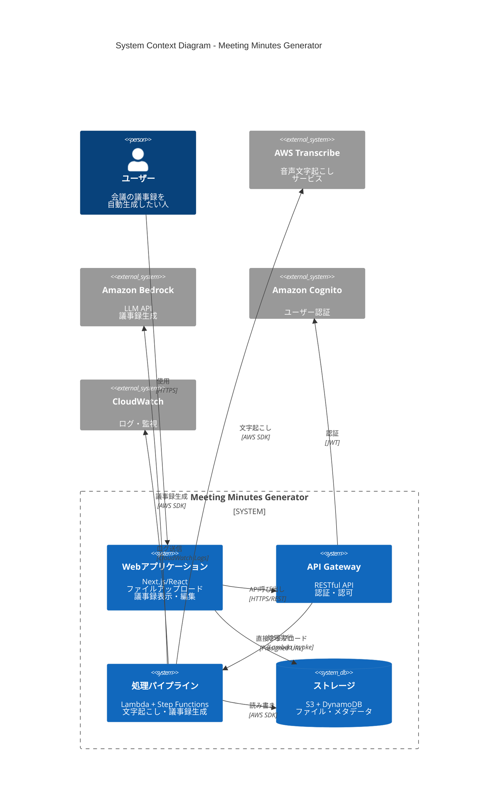
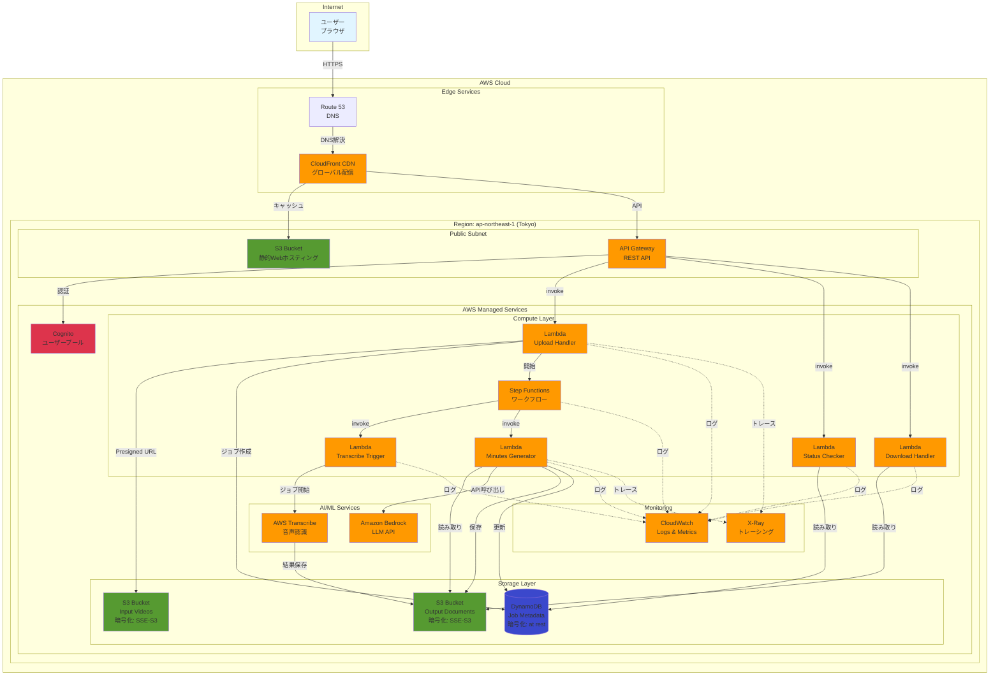
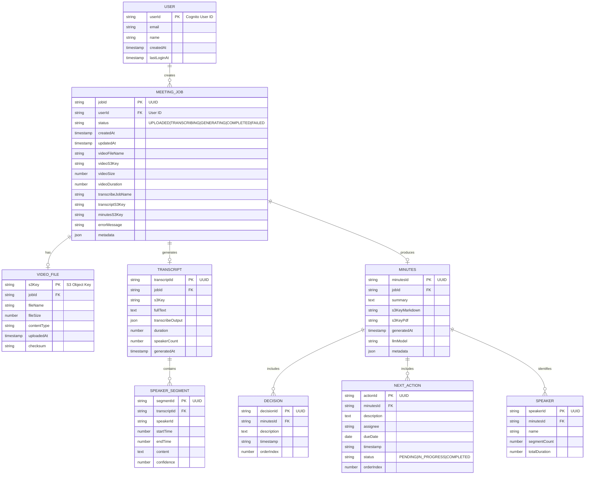

# Design Document

## Overview

このシステムは、MP4形式の会議録画ファイルから自動的に議事録を生成するサーバーレス・マイクロサービスアーキテクチャです。AWS環境をベースとし、以下の主要コンポーネントで構成されます：

- **Webフロントエンド**: React/Next.jsベースのSPA（Single Page Application）
- **APIゲートウェイ**: AWS API Gateway + Lambda関数
- **文字起こしサービス**: AWS Transcribe
- **議事録生成エンジン**: LLM（Amazon Bedrock）を使用した自然言語処理
- **ストレージ**: AWS S3（ファイル保存）、DynamoDB（メタデータ管理）
- **ワークフロー管理**: AWS Step Functions（オプションでStrands Agents統合）
- **MCP統合**: 必要に応じて外部ツールとの連携

## Architecture

### High-Level Architecture


### Sequence Diagram - Complete Flow



### System Architecture Diagram



### Network Diagram



### Entity Relationship Diagram



### Data Flow

1. **アップロードフェーズ**
   - ユーザーがWebインターフェースからMP4ファイルをアップロード
   - API GatewayがPresigned URLを生成してS3への直接アップロードを許可
   - アップロード完了後、Lambda関数がジョブをDynamoDBに記録
   - Step Functionsワークフローを開始

2. **文字起こしフェーズ**
   - Step FunctionsがAWS Transcribeジョブを起動
   - Transcribeが音声を解析して文字起こしを実行
   - 結果（JSON形式）をS3に保存
   - 話者識別（Speaker Diarization）を有効化

3. **議事録生成フェーズ**
   - Lambda関数が文字起こし結果を取得
   - Amazon Bedrockを使用してLLMに議事録生成を依頼
   - プロンプトエンジニアリングで構造化された出力を生成
   - 生成された議事録をMarkdown形式でS3に保存

4. **ダウンロードフェーズ**
   - ユーザーがGUIから議事録をリクエスト
   - Lambda関数がS3から議事録を取得
   - 必要に応じてPDF変換を実行
   - Presigned URLを返してダウンロードを許可

## Components and Interfaces

### 1. Frontend Application

**技術スタック**: Next.js 14 (App Router), React, TypeScript, TailwindCSS

**主要コンポーネント**:
- `UploadPage`: ファイルアップロードインターフェース
- `JobListPage`: 処理履歴一覧
- `JobDetailPage`: 個別ジョブの詳細と議事録表示
- `MinutesEditor`: 議事録編集コンポーネント

**API通信**:
```typescript
interface APIClient {
  // Presigned URLを取得してアップロード
  uploadVideo(file: File): Promise<{ jobId: string }>;
  
  // ジョブステータスを取得
  getJobStatus(jobId: string): Promise<JobStatus>;
  
  // ジョブ一覧を取得
  listJobs(): Promise<Job[]>;
  
  // 議事録を取得
  getMinutes(jobId: string): Promise<Minutes>;
  
  // 議事録をダウンロード
  downloadMinutes(jobId: string, format: 'markdown' | 'pdf'): Promise<string>;
}
```

### 2. API Gateway + Lambda Functions

**エンドポイント設計**:

```
POST   /api/upload          - アップロード用Presigned URL取得
GET    /api/jobs            - ジョブ一覧取得
GET    /api/jobs/{jobId}    - ジョブ詳細取得
GET    /api/jobs/{jobId}/minutes - 議事録取得
GET    /api/jobs/{jobId}/download - ダウンロードURL取得
PUT    /api/jobs/{jobId}/minutes - 議事録更新（編集機能）
```

**Lambda関数**:

1. **upload-handler**
   - Presigned URLを生成
   - DynamoDBにジョブレコードを作成
   - Step Functionsワークフローを開始

2. **status-checker**
   - DynamoDBからジョブステータスを取得
   - 処理進捗を返す

3. **download-handler**
   - S3から議事録を取得
   - PDF変換が必要な場合は変換を実行
   - Presigned URLを生成

4. **transcribe-trigger**
   - AWS Transcribeジョブを開始
   - 話者識別を有効化
   - 完了を待機

5. **minutes-generator**
   - 文字起こし結果を取得
   - Amazon Bedrockを呼び出して議事録を生成
   - 結果をS3に保存
   - DynamoDBのステータスを更新

### 3. Step Functions Workflow

**ステートマシン定義**:

```json
{
  "Comment": "Meeting Minutes Generation Workflow",
  "StartAt": "TranscribeVideo",
  "States": {
    "TranscribeVideo": {
      "Type": "Task",
      "Resource": "arn:aws:lambda:REGION:ACCOUNT:function:transcribe-trigger",
      "Next": "WaitForTranscription",
      "Catch": [{
        "ErrorEquals": ["States.ALL"],
        "Next": "HandleError"
      }]
    },
    "WaitForTranscription": {
      "Type": "Wait",
      "Seconds": 30,
      "Next": "CheckTranscriptionStatus"
    },
    "CheckTranscriptionStatus": {
      "Type": "Task",
      "Resource": "arn:aws:lambda:REGION:ACCOUNT:function:check-transcribe-status",
      "Next": "IsTranscriptionComplete"
    },
    "IsTranscriptionComplete": {
      "Type": "Choice",
      "Choices": [{
        "Variable": "$.status",
        "StringEquals": "COMPLETED",
        "Next": "GenerateMinutes"
      }],
      "Default": "WaitForTranscription"
    },
    "GenerateMinutes": {
      "Type": "Task",
      "Resource": "arn:aws:lambda:REGION:ACCOUNT:function:minutes-generator",
      "Next": "Success"
    },
    "Success": {
      "Type": "Succeed"
    },
    "HandleError": {
      "Type": "Fail",
      "Error": "WorkflowFailed",
      "Cause": "An error occurred during processing"
    }
  }
}
```

### 4. MCP Integration (Optional)

MCPを使用する場合、以下のような統合を検討：

**使用ケース**:
- 外部カレンダーシステムとの統合（会議情報の取得）
- プロジェクト管理ツールとの連携（アクションアイテムの自動登録）
- 通知システムとの連携

**実装アプローチ**:
```typescript
interface MCPClient {
  // MCPサーバーに接続
  connect(serverConfig: MCPServerConfig): Promise<void>;
  
  // ツールを呼び出し
  callTool(toolName: string, params: any): Promise<any>;
}

// 例: カレンダー情報の取得
const meetingInfo = await mcpClient.callTool('calendar.getMeeting', {
  meetingId: extractedMeetingId
});
```

### 5. Strands Agents Integration (Optional)

Strands Agentsを使用する場合の統合方法：

**使用ケース**:
- 複雑なワークフローの管理
- マルチステップの意思決定プロセス
- 動的なタスク分配

**実装アプローチ**:
- Step Functionsの代わりにStrands Agentsでワークフローを管理
- エージェントが各処理ステップを調整
- 状態管理とエラーハンドリングをエージェントに委譲

## Data Models

### DynamoDB Schema

**Table: MeetingJobs**

```typescript
interface MeetingJob {
  jobId: string;              // Partition Key (UUID)
  userId: string;             // Sort Key
  status: JobStatus;          // 'UPLOADED' | 'TRANSCRIBING' | 'GENERATING' | 'COMPLETED' | 'FAILED'
  createdAt: string;          // ISO 8601 timestamp
  updatedAt: string;          // ISO 8601 timestamp
  
  // ファイル情報
  videoFileName: string;
  videoS3Key: string;
  videoSize: number;
  videoDuration?: number;
  
  // 処理情報
  transcribeJobName?: string;
  transcriptS3Key?: string;
  minutesS3Key?: string;
  
  // エラー情報
  errorMessage?: string;
  
  // メタデータ
  metadata?: {
    meetingTitle?: string;
    meetingDate?: string;
    participants?: string[];
  };
}

type JobStatus = 
  | 'UPLOADED'      // アップロード完了
  | 'TRANSCRIBING'  // 文字起こし中
  | 'GENERATING'    // 議事録生成中
  | 'COMPLETED'     // 完了
  | 'FAILED';       // 失敗
```

**Indexes**:
- GSI: `userId-createdAt-index` - ユーザーごとのジョブ一覧取得用

### S3 Bucket Structure

```
meeting-minutes-input/
  └── {userId}/
      └── {jobId}/
          └── video.mp4

meeting-minutes-output/
  └── {userId}/
      └── {jobId}/
          ├── transcript.json      # AWS Transcribe出力
          ├── transcript.txt       # 整形されたテキスト
          ├── minutes.md           # Markdown議事録
          └── minutes.pdf          # PDF議事録（オプション）
```

### Minutes Document Structure

```typescript
interface Minutes {
  jobId: string;
  generatedAt: string;
  
  // 議事録の内容
  summary: string;              // 概要
  decisions: Decision[];        // 決定事項
  nextActions: NextAction[];    // ネクストアクション
  
  // 元データ
  transcript: string;           // 文字起こし全文
  speakers?: Speaker[];         // 話者情報
}

interface Decision {
  id: string;
  description: string;
  timestamp?: string;           // 文字起こし内のタイムスタンプ
}

interface NextAction {
  id: string;
  description: string;
  assignee?: string;            // 担当者
  dueDate?: string;             // 期限
  timestamp?: string;
}

interface Speaker {
  id: string;
  name?: string;                // 識別された場合
  segments: number;             // 発言回数
}
```

## Error Handling

### エラー分類

1. **クライアントエラー (4xx)**
   - 400 Bad Request: 無効なファイル形式、サイズ超過
   - 404 Not Found: ジョブが見つからない
   - 413 Payload Too Large: ファイルサイズ制限超過

2. **サーバーエラー (5xx)**
   - 500 Internal Server Error: 予期しないエラー
   - 503 Service Unavailable: AWS サービスの一時的な障害

### エラーハンドリング戦略

**Lambda関数レベル**:
```typescript
try {
  // 処理実行
} catch (error) {
  // CloudWatchにログ記録
  console.error('Error:', error);
  
  // DynamoDBのステータスを更新
  await updateJobStatus(jobId, 'FAILED', error.message);
  
  // ユーザーフレンドリーなエラーを返す
  return {
    statusCode: 500,
    body: JSON.stringify({
      error: 'Processing failed',
      message: getUserFriendlyMessage(error)
    })
  };
}
```

**Step Functionsレベル**:
- 各ステートにCatchブロックを設定
- リトライポリシーを定義（最大3回、指数バックオフ）
- 失敗時はDynamoDBのステータスを更新

**フロントエンドレベル**:
- エラーメッセージをトースト通知で表示
- リトライボタンを提供
- エラー詳細をログに記録

## Testing Strategy

### 1. Unit Tests

**対象**: 個別のLambda関数、ユーティリティ関数

**ツール**: Jest, AWS SDK Mocks

**テストケース例**:
```typescript
describe('minutes-generator', () => {
  it('should generate minutes from transcript', async () => {
    const transcript = 'Mock transcript...';
    const minutes = await generateMinutes(transcript);
    
    expect(minutes.summary).toBeDefined();
    expect(minutes.decisions).toBeInstanceOf(Array);
    expect(minutes.nextActions).toBeInstanceOf(Array);
  });
  
  it('should handle empty transcript', async () => {
    await expect(generateMinutes('')).rejects.toThrow();
  });
});
```

### 2. Integration Tests

**対象**: API Gateway + Lambda、Step Functions ワークフロー

**ツール**: AWS SAM Local, Localstack

**テストケース**:
- エンドツーエンドのアップロード→処理→ダウンロードフロー
- エラーケースのハンドリング
- 並行処理のテスト

### 3. End-to-End Tests

**対象**: フロントエンド + バックエンド統合

**ツール**: Playwright, Cypress

**テストケース**:
- ユーザーがMP4ファイルをアップロードして議事録を取得
- 処理進捗の表示
- 議事録の編集とダウンロード

### 4. Load Tests

**対象**: システム全体のスケーラビリティ

**ツール**: Artillery, AWS Load Testing

**テストシナリオ**:
- 同時に100ファイルのアップロード
- 大容量ファイル（1GB以上）の処理
- 長時間の会議（3時間以上）の処理

## Security Considerations

### 認証・認可

**実装方法**: Amazon Cognito

- ユーザープールでユーザー管理
- JWTトークンによるAPI認証
- IAMロールによるリソースアクセス制御

### データ保護

- **転送中**: HTTPS/TLS 1.2以上
- **保存時**: S3サーバーサイド暗号化（SSE-S3またはSSE-KMS）
- **アクセス制御**: S3バケットポリシー、IAMポリシー

### ファイルバリデーション

```typescript
function validateUpload(file: File): ValidationResult {
  // ファイル形式チェック
  if (!file.name.endsWith('.mp4')) {
    return { valid: false, error: 'Only MP4 files are allowed' };
  }
  
  // ファイルサイズチェック（例: 2GB制限）
  if (file.size > 2 * 1024 * 1024 * 1024) {
    return { valid: false, error: 'File size exceeds 2GB limit' };
  }
  
  // MIMEタイプチェック
  if (file.type !== 'video/mp4') {
    return { valid: false, error: 'Invalid file type' };
  }
  
  return { valid: true };
}
```

## Deployment Strategy

### Infrastructure as Code

**ツール**: AWS CDK (TypeScript)

**スタック構成**:
- `NetworkStack`: VPC、サブネット（必要な場合）
- `StorageStack`: S3バケット、DynamoDB
- `ComputeStack`: Lambda関数、Step Functions
- `APIStack`: API Gateway、CloudFront
- `FrontendStack`: S3静的ホスティング、CloudFront

### CI/CD Pipeline

**ツール**: GitHub Actions または AWS CodePipeline

**パイプラインステージ**:
1. **Build**: TypeScriptコンパイル、依存関係インストール
2. **Test**: ユニットテスト、統合テスト実行
3. **Deploy to Staging**: ステージング環境へのデプロイ
4. **E2E Tests**: ステージング環境でのE2Eテスト
5. **Deploy to Production**: 本番環境へのデプロイ

### Monitoring and Observability

- **CloudWatch Logs**: すべてのLambda関数のログ
- **CloudWatch Metrics**: カスタムメトリクス（処理時間、成功率）
- **X-Ray**: 分散トレーシング
- **CloudWatch Alarms**: エラー率、レイテンシの監視

## Cost Optimization

### 推定コスト（月間100ジョブの場合）

- **S3**: ~$5（ストレージ + データ転送）
- **Lambda**: ~$10（実行時間）
- **Transcribe**: ~$60（100時間の音声）
- **Bedrock**: ~$20（LLM API呼び出し）
- **DynamoDB**: ~$5（オンデマンド）
- **API Gateway**: ~$3
- **CloudFront**: ~$5

**合計**: 約$108/月

### コスト削減策

- S3ライフサイクルポリシーで古いファイルをGlacierに移動
- Lambda関数のメモリ最適化
- DynamoDBのオンデマンドモード使用
- CloudFrontキャッシュの活用

## Future Enhancements

1. **リアルタイム文字起こし**: ライブ会議の同時文字起こし
2. **多言語対応**: 複数言語の文字起こしと翻訳
3. **カスタムテンプレート**: 議事録フォーマットのカスタマイズ
4. **AI要約の改善**: より高度な要約アルゴリズム
5. **コラボレーション機能**: 複数ユーザーでの議事録編集
6. **音声検索**: 文字起こしテキストの全文検索
7. **アクションアイテム追跡**: タスク管理ツールとの統合
