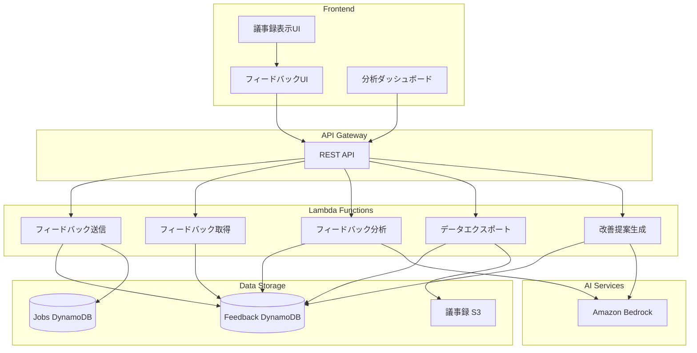

# 設計書

## 概要

本設計書は、議事録作成ツールにユーザーフィードバック機能を追加するための詳細設計を記述します。ユーザーが生成された議事録に対して評価や修正を提供し、そのデータを収集・分析することで、システムの精度を継続的に向上させます。

## アーキテクチャ

### システム構成図



### データフロー

1. **フィードバック収集フロー**
   - ユーザーが議事録を評価（良い/悪い）
   - 問題点や修正内容を入力
   - Lambda関数がDynamoDBに保存
   - ジョブテーブルにフィードバック状態を更新

2. **分析フロー**
   - 定期的または手動でフィードバックデータを集計
   - Bedrockを使用してパターン分析
   - 改善提案を生成
   - 管理者に通知

3. **学習データ生成フロー**
   - 修正履歴から学習ペアを抽出
   - ファインチューニング用フォーマットに変換
   - S3にエクスポート

## コンポーネントとインターフェース

### 1. DynamoDBテーブル設計

#### Feedbackテーブル

```typescript
interface FeedbackRecord {
  // パーティションキー
  jobId: string;
  
  // ソートキー
  feedbackId: string; // timestamp-uuid形式
  
  // 基本情報
  userId: string;
  createdAt: string; // ISO 8601形式
  updatedAt: string;
  
  // 評価情報
  rating: 'positive' | 'negative';
  
  // 問題点（negativeの場合）
  issues?: {
    category: 'accuracy' | 'missing_info' | 'unnecessary_info' | 'format' | 'other';
    description: string;
    sectionId?: string; // 問題のあるセクション
  }[];
  
  // 修正履歴
  corrections?: {
    sectionType: 'summary' | 'topic' | 'decision' | 'nextAction';
    sectionId?: string;
    originalText: string;
    correctedText: string;
    timestamp: string;
  }[];
  
  // メタデータ
  metadata?: {
    minutesVersion?: string;
    deviceType?: string;
    sessionDuration?: number;
  };
}
```

#### GSI (Global Secondary Index)

1. **UserIdIndex**: userId (PK) + createdAt (SK)
   - ユーザー別のフィードバック取得用

2. **RatingIndex**: rating (PK) + createdAt (SK)
   - 評価別の集計用

3. **CreatedAtIndex**: createdAt (PK) + jobId (SK)
   - 時系列分析用

### 2. Lambda関数設計

#### SubmitFeedbackHandler

```typescript
interface SubmitFeedbackRequest {
  jobId: string;
  rating: 'positive' | 'negative';
  issues?: Array<{
    category: string;
    description: string;
    sectionId?: string;
  }>;
  corrections?: Array<{
    sectionType: string;
    sectionId?: string;
    originalText: string;
    correctedText: string;
  }>;
}

interface SubmitFeedbackResponse {
  success: boolean;
  feedbackId: string;
  message: string;
}
```

**処理フロー:**
1. リクエストのバリデーション
2. feedbackIdの生成（timestamp-uuid）
3. DynamoDBにフィードバックレコードを保存
4. Jobsテーブルのfeedback状態を更新
5. レスポンスを返す

#### GetFeedbackHandler

```typescript
interface GetFeedbackRequest {
  jobId?: string;
  userId?: string;
  startDate?: string;
  endDate?: string;
  rating?: 'positive' | 'negative';
  limit?: number;
  lastEvaluatedKey?: string;
}

interface GetFeedbackResponse {
  success: boolean;
  feedbacks: FeedbackRecord[];
  lastEvaluatedKey?: string;
  count: number;
}
```

**処理フロー:**
1. クエリパラメータに基づいてDynamoDBをクエリ
2. 適切なインデックスを使用
3. ページネーション対応
4. フィードバックリストを返す

#### AnalyzeFeedbackHandler

```typescript
interface AnalyzeFeedbackRequest {
  startDate?: string;
  endDate?: string;
  analysisType: 'statistics' | 'patterns' | 'quality_trends';
}

interface AnalyzeFeedbackResponse {
  success: boolean;
  analysis: {
    totalFeedbacks: number;
    positiveRate: number;
    negativeRate: number;
    issueCategories: Record<string, number>;
    commonPatterns?: string[];
    qualityScore?: number;
    trends?: Array<{
      date: string;
      positiveRate: number;
    }>;
  };
}
```

**処理フロー:**
1. 指定期間のフィードバックを取得
2. 統計情報を計算
3. 問題カテゴリを集計
4. Bedrockを使用してパターン分析（オプション）
5. 分析結果を返す

#### GenerateInsightsHandler

```typescript
interface GenerateInsightsRequest {
  startDate?: string;
  endDate?: string;
  minFeedbackCount?: number;
}

interface GenerateInsightsResponse {
  success: boolean;
  insights: {
    promptImprovements: Array<{
      issue: string;
      frequency: number;
      suggestedFix: string;
      priority: 'high' | 'medium' | 'low';
    }>;
    qualityMetrics: {
      currentScore: number;
      previousScore: number;
      trend: 'improving' | 'declining' | 'stable';
    };
  };
}
```

**処理フロー:**
1. フィードバックデータを収集
2. 問題パターンを抽出
3. Bedrockを使用して改善提案を生成
4. 優先度を計算
5. 提案リストを返す

#### ExportTrainingDataHandler

```typescript
interface ExportTrainingDataRequest {
  startDate?: string;
  endDate?: string;
  format: 'bedrock' | 'jsonl' | 'csv';
  minQualityScore?: number;
}

interface ExportTrainingDataResponse {
  success: boolean;
  exportUrl: string; // S3 Presigned URL
  recordCount: number;
}
```

**処理フロー:**
1. 修正履歴を含むフィードバックを取得
2. 学習データ形式に変換
3. S3にアップロード
4. Presigned URLを生成
5. URLを返す

### 3. フロントエンドコンポーネント

#### FeedbackWidget

議事録表示ページに統合されるフィードバックウィジェット

```typescript
interface FeedbackWidgetProps {
  jobId: string;
  onFeedbackSubmitted?: () => void;
}

// 機能:
// - 良い/悪いボタン
// - 問題カテゴリ選択
// - 問題説明テキストエリア
// - 送信ボタン
// - 送信状態表示
```

#### CorrectionTracker

議事録編集時に自動的に修正を記録するコンポーネント

```typescript
interface CorrectionTrackerProps {
  jobId: string;
  originalContent: Minutes;
  onSave: (corrections: Correction[]) => Promise<void>;
}

// 機能:
// - 編集前後の差分を自動検出
// - 修正内容を構造化
// - 保存時にフィードバックAPIに送信
```

#### AnalyticsDashboard

管理者向けの分析ダッシュボード

```typescript
interface AnalyticsDashboardProps {
  dateRange: { start: string; end: string };
}

// 機能:
// - 評価統計の表示
// - 問題カテゴリ分布グラフ
// - 品質トレンドグラフ
// - 改善提案リスト
// - データエクスポート機能
```

## データモデル

### Feedbackエンティティ

```typescript
class Feedback {
  jobId: string;
  feedbackId: string;
  userId: string;
  rating: Rating;
  issues: Issue[];
  corrections: Correction[];
  createdAt: Date;
  updatedAt: Date;
  
  constructor(data: FeedbackData);
  validate(): boolean;
  toJSON(): FeedbackRecord;
}

enum Rating {
  POSITIVE = 'positive',
  NEGATIVE = 'negative'
}

interface Issue {
  category: IssueCategory;
  description: string;
  sectionId?: string;
}

enum IssueCategory {
  ACCURACY = 'accuracy',
  MISSING_INFO = 'missing_info',
  UNNECESSARY_INFO = 'unnecessary_info',
  FORMAT = 'format',
  OTHER = 'other'
}

interface Correction {
  sectionType: SectionType;
  sectionId?: string;
  originalText: string;
  correctedText: string;
  timestamp: Date;
}

enum SectionType {
  SUMMARY = 'summary',
  TOPIC = 'topic',
  DECISION = 'decision',
  NEXT_ACTION = 'nextAction'
}
```

## 正確性プロパティ

*プロパティとは、システムのすべての有効な実行において真であるべき特性や動作のことです。これらは人間が読める仕様と機械で検証可能な正確性保証の橋渡しとなります。*

### プロパティ1: フィードバック永続化の一貫性

*すべての*有効なフィードバック送信に対して、送信後にDynamoDBから同じフィードバックを取得できる
**検証: 要件 1.4**

### プロパティ2: 評価状態の保持

*すべての*評価済み議事録に対して、再度取得したときに同じ評価状態（rating、issues、corrections）が返される
**検証: 要件 1.5**

### プロパティ3: 入力バリデーションの境界

*すべての*1000文字以下の問題説明は受け入れられ、1000文字を超える説明は拒否される
**検証: 要件 2.2**

### プロパティ4: フィードバックデータの完全性

*すべての*フィードバック取得に対して、返されるデータには評価、問題カテゴリ、修正履歴のすべてのフィールドが含まれる
**検証: 要件 4.2**

### プロパティ5: 期間フィルタリングの正確性

*すべての*期間指定クエリに対して、返されるフィードバックの作成日時は指定された範囲内である
**検証: 要件 4.3**

### プロパティ6: 統計計算の正確性

*すべての*フィードバックデータセットに対して、計算された肯定的評価率は (肯定的評価数 / 総評価数) × 100 に等しい
**検証: 要件 4.4**

### プロパティ7: フィードバックIDの一意性

*すべての*フィードバック送信に対して、生成されるfeedbackIdは他のすべてのfeedbackIdと異なる
**検証: 要件 5.1**

### プロパティ8: jobIdによるフィルタリング

*すべての*jobIdでのクエリに対して、返されるフィードバックのjobIdはクエリで指定されたjobIdと一致する
**検証: 要件 5.4**

### プロパティ9: データ型の保持

*すべての*フィードバック保存に対して、取得時にすべてのフィールドの型（string、number、boolean、Date）が保持されている
**検証: 要件 5.5**

### プロパティ10: バリデーションエラーメッセージ

*すべての*無効なフィードバックデータに対して、APIは具体的なエラーメッセージを含む400エラーを返す
**検証: 要件 6.4**

### プロパティ11: JSONエクスポート形式

*すべての*フィードバックエクスポートに対して、出力は有効なJSON形式であり、JSON.parse()でパースできる
**検証: 要件 7.1**

### プロパティ12: 修正履歴ペアの完全性

*すべての*修正履歴エクスポートに対して、各エントリにはoriginalTextとcorrectedTextの両方が含まれる
**検証: 要件 7.2**

### プロパティ13: カテゴリ頻度計算の正確性

*すべての*問題カテゴリ分析に対して、各カテゴリの出現頻度の合計は総フィードバック数以下である
**検証: 要件 7.3**

### プロパティ14: 時系列データの順序性

*すべての*時系列評価推移に対して、返されるデータポイントは日付の昇順でソートされている
**検証: 要件 7.4**

### プロパティ15: 修正パターン抽出の一貫性

*すべての*修正履歴分析に対して、同じ修正パターンが複数回出現する場合、そのパターンは抽出結果に含まれる
**検証: 要件 8.2**

### プロパティ16: プロンプトバージョン管理

*すべての*プロンプト更新に対して、新しいバージョンが作成され、古いバージョンも保持される
**検証: 要件 8.5**

### プロパティ17: 品質スコアの存在

*すべての*議事録生成に対して、品質スコアが計算され、0から100の範囲内の数値である
**検証: 要件 9.1**

### プロパティ18: フィードバック参照の一貫性

*すべての*品質スコア計算に対して、過去のフィードバックが存在する場合、それらが計算に反映される
**検証: 要件 9.2**

### プロパティ19: 品質指標の適用

*すべての*新しい議事録生成に対して、最新の品質指標が適用される
**検証: 要件 9.4**

### プロパティ20: 学習データペアの記録

*すべての*議事録修正に対して、修正前後のテキストペアが学習データとして記録される
**検証: 要件 10.1**

### プロパティ21: データセットペアの完全性

*すべての*生成されたデータセットに対して、各エントリには入力（元の議事録）と期待出力（修正後の議事録）の両方が含まれる
**検証: 要件 10.3**

### プロパティ22: データ品質チェックの実行

*すべての*データセット生成に対して、空の入力や出力を含むエントリは品質チェックで検出され除外される
**検証: 要件 10.4**

### プロパティ23: Bedrock形式の準拠

*すべての*エクスポートされたデータセットに対して、Bedrockのファインチューニング形式（JSONL形式で各行に{"prompt": "...", "completion": "..."}）に準拠している
**検証: 要件 10.5**


## エラーハンドリング

### エラー分類

#### 1. バリデーションエラー (400)

```typescript
class ValidationError extends Error {
  statusCode = 400;
  errors: Array<{
    field: string;
    message: string;
  }>;
}

// 例:
// - feedbackIdが不正な形式
// - 問題説明が1000文字を超える
// - 必須フィールドが欠落
// - 無効なカテゴリ値
```

#### 2. 認証エラー (401/403)

```typescript
class AuthenticationError extends Error {
  statusCode = 401;
}

class AuthorizationError extends Error {
  statusCode = 403;
}

// 例:
// - ユーザーIDが取得できない
// - 他のユーザーのフィードバックにアクセス
```

#### 3. リソース未検出エラー (404)

```typescript
class NotFoundError extends Error {
  statusCode = 404;
  resource: string;
}

// 例:
// - 指定されたjobIdが存在しない
// - フィードバックが見つからない
```

#### 4. 内部サーバーエラー (500)

```typescript
class InternalServerError extends Error {
  statusCode = 500;
  originalError?: Error;
}

// 例:
// - DynamoDB接続エラー
// - Bedrock APIエラー
// - S3アクセスエラー
```

### エラーハンドリング戦略

1. **Lambda関数レベル**
   - try-catchブロックで例外をキャッチ
   - エラーログをCloudWatch Logsに記録
   - 適切なHTTPステータスコードとエラーメッセージを返す

2. **フロントエンドレベル**
   - APIエラーをtoastで表示
   - ネットワークエラー時は再試行を促す
   - ローディング状態を適切に管理

3. **リトライ戦略**
   - DynamoDBの一時的なエラーは指数バックオフでリトライ
   - Bedrock APIのレート制限エラーは待機後リトライ
   - 最大3回までリトライ

## テスト戦略

### 二重テストアプローチ

本システムでは、ユニットテストとプロパティベーステストの両方を実装します：

- **ユニットテスト**: 特定の例、エッジケース、エラー条件を検証
- **プロパティベーステスト**: すべての入力に対して成り立つべき普遍的なプロパティを検証

両者は補完的であり、ユニットテストは具体的なバグを捉え、プロパティテストは一般的な正確性を検証します。

### プロパティベーステスト

**使用ライブラリ**: fast-check (TypeScript/JavaScript用)

**設定**:
- 各プロパティテストは最低100回の反復を実行
- ランダムなテストデータを生成してプロパティを検証

**プロパティテストの例**:

```typescript
import fc from 'fast-check';

// **Feature: minutes-feedback-system, Property 1: フィードバック永続化の一貫性**
describe('Property 1: Feedback persistence consistency', () => {
  it('should retrieve the same feedback after submission', async () => {
    await fc.assert(
      fc.asyncProperty(
        fc.record({
          jobId: fc.uuid(),
          userId: fc.uuid(),
          rating: fc.constantFrom('positive', 'negative'),
          issues: fc.array(fc.record({
            category: fc.constantFrom('accuracy', 'missing_info', 'unnecessary_info', 'format', 'other'),
            description: fc.string({ maxLength: 1000 }),
          })),
        }),
        async (feedbackData) => {
          // フィードバックを送信
          const submitResponse = await submitFeedback(feedbackData);
          
          // 送信されたフィードバックを取得
          const retrievedFeedback = await getFeedback(submitResponse.feedbackId);
          
          // 送信したデータと取得したデータが一致することを確認
          expect(retrievedFeedback.rating).toBe(feedbackData.rating);
          expect(retrievedFeedback.issues).toEqual(feedbackData.issues);
        }
      ),
      { numRuns: 100 }
    );
  });
});

// **Feature: minutes-feedback-system, Property 7: フィードバックIDの一意性**
describe('Property 7: Feedback ID uniqueness', () => {
  it('should generate unique feedback IDs for all submissions', async () => {
    await fc.assert(
      fc.asyncProperty(
        fc.array(fc.record({
          jobId: fc.uuid(),
          userId: fc.uuid(),
          rating: fc.constantFrom('positive', 'negative'),
        }), { minLength: 10, maxLength: 100 }),
        async (feedbackArray) => {
          // 複数のフィードバックを送信
          const feedbackIds = await Promise.all(
            feedbackArray.map(data => submitFeedback(data))
          ).then(responses => responses.map(r => r.feedbackId));
          
          // すべてのIDが一意であることを確認
          const uniqueIds = new Set(feedbackIds);
          expect(uniqueIds.size).toBe(feedbackIds.length);
        }
      ),
      { numRuns: 100 }
    );
  });
});
```

### ユニットテスト

**対象**:
- Lambda関数のビジネスロジック
- データ変換関数
- バリデーション関数
- エラーハンドリング

**ユニットテストの例**:

```typescript
describe('SubmitFeedbackHandler', () => {
  it('should reject feedback with description over 1000 characters', async () => {
    const longDescription = 'a'.repeat(1001);
    const feedback = {
      jobId: 'test-job-id',
      rating: 'negative',
      issues: [{
        category: 'accuracy',
        description: longDescription,
      }],
    };
    
    await expect(submitFeedback(feedback)).rejects.toThrow(ValidationError);
  });
  
  it('should display error message when submission fails', async () => {
    // モックAPIエラー
    mockApiError();
    
    const result = await submitFeedbackUI(validFeedback);
    
    expect(result.errorMessage).toBeDefined();
    expect(result.errorMessage).toContain('送信に失敗しました');
  });
});
```

### 統合テスト

**対象**:
- API Gateway → Lambda → DynamoDB の完全なフロー
- フロントエンド → API の統合
- Bedrockとの連携

### E2Eテスト

**対象**:
- ユーザーが議事録を評価するフロー
- 議事録を編集して保存するフロー
- 管理者がフィードバックを分析するフロー

## セキュリティ考慮事項

### 1. 認証・認可

- すべてのAPIエンドポイントはCognito認証を要求
- ユーザーは自分のフィードバックのみアクセス可能
- 管理者APIは特別な権限を要求

### 2. データプライバシー

- 個人を特定できる情報（PII）は最小限に
- エクスポート時はuserIdをハッシュ化
- GDPR準拠のためのデータ削除機能

### 3. 入力バリデーション

- すべての入力をサーバーサイドで検証
- SQLインジェクション対策（DynamoDBは自動的に安全）
- XSS対策（フロントエンドでサニタイズ）

### 4. レート制限

- API Gatewayでレート制限を設定
- 1ユーザーあたり1分間に10リクエストまで
- Bedrock APIの使用量を監視

## パフォーマンス最適化

### 1. DynamoDB最適化

- 適切なパーティションキー設計（jobId）
- GSIを使用した効率的なクエリ
- バッチ操作の活用

### 2. キャッシング

- フロントエンドでフィードバック状態をキャッシュ
- API Gatewayのキャッシング（管理者API）
- CloudFrontでの静的コンテンツキャッシング

### 3. 非同期処理

- 大量データの分析は非同期で実行
- Step Functionsを使用した長時間処理
- SQSキューでのバッチ処理

## モニタリングとアラート

### CloudWatchメトリクス

1. **フィードバック送信率**
   - 成功率
   - 失敗率
   - レスポンスタイム

2. **評価分布**
   - 肯定的評価の割合
   - 否定的評価の割合
   - 問題カテゴリ別の分布

3. **システムヘルス**
   - Lambda関数のエラー率
   - DynamoDBのスロットリング
   - Bedrock APIのレート制限

### アラート設定

- フィードバック送信失敗率が10%を超えた場合
- 否定的評価が急増した場合（前日比50%増）
- Lambda関数のエラー率が5%を超えた場合

## デプロイメント戦略

### 段階的ロールアウト

1. **Phase 1**: 基本的なフィードバック収集機能
   - 評価ボタン
   - 問題点の記述
   - DynamoDBへの保存

2. **Phase 2**: 修正履歴の記録
   - 編集差分の検出
   - 修正履歴の保存

3. **Phase 3**: 分析機能
   - 統計情報の表示
   - 問題パターンの分析

4. **Phase 4**: AI活用機能
   - プロンプト改善提案
   - 品質スコア計算
   - 学習データ生成

### ブルーグリーンデプロイメント

- 新バージョンを別環境にデプロイ
- トラフィックを段階的に切り替え
- 問題があれば即座にロールバック

## 今後の拡張性

### 1. マルチモーダルフィードバック

- 音声フィードバックの収集
- スクリーンショットの添付
- ビデオクリップの記録

### 2. リアルタイム分析

- ストリーミング分析（Kinesis）
- リアルタイムダッシュボード
- 即座のアラート

### 3. A/Bテスト機能

- 複数のプロンプトバージョンをテスト
- 自動的に最良のバージョンを選択
- 統計的有意性の検証

### 4. コラボレーション機能

- チーム内でのフィードバック共有
- コメント機能
- フィードバックへの返信
